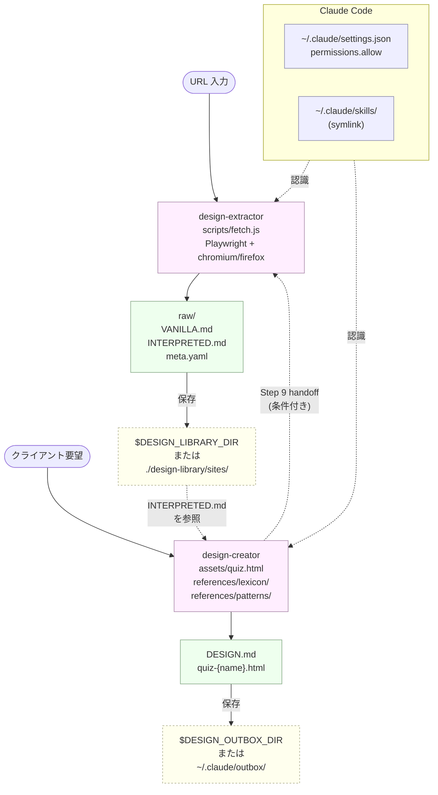

# advanced-design-md

[](LICENSE)
[](https://nodejs.org/)
[](https://claude.com/claude-code)
[](https://playwright.dev/)

[English version: README.en.md](README.en.md) ／ とりあえず動かしたい方は [かんたんせつめいしょ](QUICKSTART.md) へ ／ Casual quick-start (English): [QUICKSTART.en.md](QUICKSTART.en.md)

Claude Code のスキル 2 つを組み合わせ、デザイン仕様書（DESIGN.md）を半自動で生成するためのツールキットです。

- 既存サイトを参照しデザイン情報を **抽出** して仕様化する（design-extractor）
- 言語化されていない要望をクイズ形式で引き出して仕様化する（design-creator）

生成された DESIGN.md は人間が読む仕様書として利用できるほか、AI 実装ツールへの入力として使用することも想定しています。

---

## 必要環境

- Node.js 18 以上（design-extractor が Playwright を使用するため）
- Claude Code（CLI 版を想定。他環境では一部機能が動作しない場合があります）
- macOS / Linux / WSL2
- `python3`（クイズ HTML を localhost で配信するために使用します）

---

## セキュリティに関する注意

design-extractor は Playwright を内蔵 Chromium / Firefox で起動し、対象ページ内で `fetch` を実行して `<script src>` 等の補完取得を行います。この経路は対象サイトと同一オリジンのリクエストとして発行されるため、ブラウザに保存された Cookie や認証情報が伴う可能性があります。

以下を遵守してください。

- 業務環境のログイン済みプロファイルを共用しないでください。Playwright は専用プロファイルを生成するため通常は問題ありませんが、ブラウザバイナリ自体に外部から既存のセッションを引き継ぐ拡張を入れている場合は注意が必要です
- 認証保護下のページ（管理画面・社内ツール等）を抽出する用途は想定外です。公開サイトの抽出のみを推奨します
- 抽出結果（`raw/` 配下）には対象サイトの DOM・CSS・JS が保存されます。社内資産を含む場合は出力ディレクトリを Git 管理対象から除外してください

---

## セットアップ手順

### Step 1. Claude Code のインストール

未導入の場合は公式ドキュメント（[claude.com/claude-code](https://claude.com/claude-code)）に従ってインストールしてください。

```bash
npm install -g @anthropic-ai/claude-code
claude --version
```

ログインは `claude` 起動時に表示される指示に従ってください。

### Step 2. リポジトリのクローン

```bash
git clone https://github.com/MaryCache/advanced-design-md.git ~/advanced-design-md
```

クローン先は任意です。本書では `~/advanced-design-md` を前提とします。

### Step 3. Claude Code へのスキル登録

`~/.claude/skills/` 配下にシンボリックリンクを配置することで Claude Code がスキルを認識します。

```bash
mkdir -p ~/.claude/skills
ln -s ~/advanced-design-md/skills/design-extractor ~/.claude/skills/design-extractor
ln -s ~/advanced-design-md/skills/design-creator   ~/.claude/skills/design-creator
```

`ls ~/.claude/skills/` を実行し、2 件のリンクが表示されれば登録は完了です。

### Step 4. Playwright のインストール（初回のみ）

design-extractor が URL を取得する際に必要となります。本ステップは省略しても差し支えありません。Claude が design-extractor を初めて呼び出した時点で自動的に実行されます。

手動で実行する場合は次のとおりです。

```bash
cd ~/advanced-design-md/skills/design-extractor
npm install
npx playwright install chromium
```

### Step 5. 確認プロンプトの抑制（推奨）

両スキルは内部的に `mkdir`、`cp`、`python3 -m http.server`、`npm install` 等のコマンドを実行します。Claude Code はこれらの実行ごとに `Do you want to proceed?` プロンプトを表示するため、放置するとフローが頻繁に分断されます。

初回起動時に Claude が権限マージを提案します。`yes` と回答することで自動的に設定が反映されます。手動で適用する場合は、`~/advanced-design-md/settings.recommended.json` の `permissions.allow` 配列を `~/.claude/settings.json` の同名キー配下に統合してください。

```jsonc
// ~/.claude/settings.json の例
{
  "language": "日本語",
  "model": "opus",
  "permissions": {
    "allow": [
      "Bash(mkdir -p:*)",
      "Bash(cp:*)",
      "Bash(python3 -m http.server:*)",
      "Bash(npm install)",
      "Bash(npx playwright install:*)"
      // settings.recommended.json の全項目を追記
    ]
  }
}
```

許可対象は「ファイル作成・コピー・既知のサーバー起動・依存物のインストール」に限定されています。`rm`、`git push`、外向きの `curl`、任意 PID への `kill`、任意プロセスへの `pkill` 等は含まれません（必要時は都度確認に任せます）。

### Step 6. 出力先の固定（任意）

毎回保存先を指定する手間を省く場合、環境変数で固定します。

```bash
# ~/.bashrc / ~/.zshrc に追記
export DESIGN_LIBRARY_DIR="$HOME/my-design-library/sites"   # design-extractor の出力ベース
export DESIGN_OUTBOX_DIR="$HOME/.claude/outbox"             # design-creator の出力先
```

未設定時のフォールバック順序は次のとおりです。

| スキル | フォールバック順序 |
|---|---|
| design-extractor | `output=` 引数 → `$DESIGN_LIBRARY_DIR` → `~/design-library/sites/` → `./design-library/sites/` |
| design-creator | `output=` 引数 → `$DESIGN_OUTBOX_DIR` → `~/.claude/outbox/` → `./outbox/` |

---

## 使用例

### シナリオ A: 既存サイトからの抽出

```
ユーザー: このサイトを抽出してください https://www.apple.com

Claude:   保存フォルダ名（スラグ）を指定してください。
          例: apple-home / google-store / microsoft-corp

ユーザー: apple-home

Claude:   → fetch.js により DOM / CSS / JS を取得
          → VANILLA.md を生成（生抽出・推測補完なし）
          → INTERPRETED.md を生成（VANILLA を意味付け解釈）
          → meta.yaml を生成
          ✓ 保存先: ~/my-design-library/sites/apple-home/
```

生成される成果物の構成は以下のとおりです。

```
<output-base>/apple-home/
├── raw/                  # fetch 結果（dom.html, styles/, scripts/, behavior-log.json）
├── VANILLA.md            # 生抽出（CSS変数・色値・keyframes を原文のまま記録）
├── INTERPRETED.md        # 意味付け解釈（tone / effect / states を Claude が付与）
└── meta.yaml             # 取得元 URL、タグ、メモ
```

### シナリオ B: ヒアリングによる仕様生成

```
ユーザー: コーポレートサイトのデザインを検討したい

Claude:   ボリュームを選択してください。
          - quick (5問・5分)      → [要確認] が約 50% 残存する想定
          - standard (10問・10分) → [要確認] 30% 以下
          - deep (20問・20分)     → [要確認] 20% 以下

ユーザー: standard

Claude:   → quiz-corporate-modern.html を localhost で配信
          → ブラウザで開き設問に回答してください
          → 回答完了後、出力プロンプトを貼り付けてください

（ユーザーがブラウザで回答し、コピーボタンで取得したプロンプトを Claude に貼付）

Claude:   → 回答プロンプトをパース
          → lexicon と照合（colors / typography / animations / parts）
          → patterns を参照（mood × use の組み合わせ経験則）
          → DESIGN.md を生成
          ✓ 保存先: ~/.claude/outbox/DESIGN-corporate-modern.md
```

生成される成果物は以下のとおりです。

```
<outbox>/
├── quiz-corporate-modern.html    # 回答済みクイズ（履歴・再編集用）
└── DESIGN-corporate-modern.md    # 仕様書本体
```

#### クイズの操作

- **言語切替**: 右上のドロップダウンから日本語 / English を切り替えられます。回答状態は維持されます
- **AI への相談**: 各設問に配置された相談ボタンから Claude に対話的な助言を求められます
- **自由入力**: 提示された選択肢に該当しない要望は自然文で記述します。Claude 側では `[要確認]` として保存されます

#### 補助抽出オファー（design-creator → design-extractor）

クイズの自由入力に「Google のような」「Apple 風」など固有名詞や、lexicon に該当しない語が含まれる場合、Claude は次のような提案を行います。

```
「Apple 風」のニュアンスは lexicon のみでは表現が困難です。
参照可能なサイト URL があれば抽出を実行可能ですが、いかがいたしますか？ (yes / no)
```

`yes` と回答すると design-extractor が背後で実行され、抽出結果がライブラリに追加された後に DESIGN.md 生成へ反映されます。

---

## 出力サンプルの参照

`skills/design-creator/references/samples/` 配下に複数の DESIGN.md サンプルが配置されています。最終出力の形式を事前に確認したい場合は当該ディレクトリを参照してください。

---

## ライブラリ蓄積時の推奨配置

継続的に使用することで、以下の構造で個人用デザインライブラリが蓄積されます。

```
~/my-design-library/
├── sites/                          ← design-extractor の出力
│   ├── apple-home/
│   ├── google-store/
│   └── microsoft-corp/
└── briefs/                         ← design-creator の出力（任意整理）
    ├── DESIGN-corporate-modern.md
    └── DESIGN-portfolio-minimal.md
```

整理ルールは利用者の判断に委ねられています。`~/.claude/outbox/` から手動で移動する方法、git で管理する方法など任意です。

---

## DESIGN.md の実装フェーズへの引き継ぎ

仕様書を起点とした実装には次の選択肢があります。

| 方法 | 概要 |
|---|---|
| 手動実装 | DESIGN.md を仕様書として参照し、HTML / CSS / Tailwind 等を直接実装 |
| 自作スキル | DESIGN.md を読み込みモック HTML を生成する Claude Code スキルを構築 |
| 他 AI ツール | DESIGN.md を v0 / Lovable / Cursor 等に投入し初稿を生成 |

DESIGN.md と INTERPRETED.md は同系統のセクション構成（Colors / Typography / Spacing / Components / Animations / Constraints）を採用しており、実装側は両者を統一的に扱えます。先頭セクションのみ目的別に異なります。

| スキル | 出力ファイル | 先頭セクション |
|---|---|---|
| design-extractor | VANILLA.md / INTERPRETED.md | `## Meta`（取得元 URL・抽出日） |
| design-creator | DESIGN.md | `## Intent`（Use / Mood / 第一印象軸 / Target / 差別化軸） |

---

## トラブルシュート

| 症状 | 対処 |
|---|---|
| `node: command not found` | Node.js 18 以上をインストール |
| `playwright not found` | `cd ~/advanced-design-md/skills/design-extractor && npm install && npx playwright install chromium` を実行 |
| 確認プロンプトが頻発する | Step 5 の権限マージを実施 |
| クイズが `ERR_FILE_NOT_FOUND` で開かない | スキルは自動的に `python3 -m http.server` を起動します。起動しない場合は `cd ~/.claude/outbox && python3 -m http.server 8765` を手動で実行 |
| Claude がスキルを認識しない | `ls ~/.claude/skills/` で symlink を確認し、Claude Code を再起動 |
| 抽出が極端に遅延する、またはタイムアウトする | 対象サイトの JavaScript が重量である可能性があります。`skills/design-extractor/references/troubleshooting.md` を参照 |
| Chromium で抽出が失敗する（特定サイトで bot 検出・レンダリング不一致が発生する） | `BROWSER=firefox` 環境変数を指定して再実行します。例: `BROWSER=firefox node scripts/fetch.js <URL> <output-dir>`。Firefox 用ブラウザは `npx playwright install firefox` で取得できます |

---

## アーキテクチャと設計仕様

本セクションでは、本ツールキットの内部構造と、各種データの取り扱いに関する設計判断を記述します。利用者として動作させるだけであれば本セクションの理解は不要です。スキルの拡張・改修・統合を行う場合の参照資料として位置付けています。

### 1. 全体アーキテクチャ

#### データフロー



#### スキル間の連携モデル

両スキルは独立して動作可能ですが、design-creator は **Step 9** において、特定条件下で design-extractor を呼び出す権限を持ちます。これにより、lexicon の有限性に起因する表現不足を、参照サイトの抽出によって補完できます。

連携は **単方向**（creator → extractor）であり、extractor 側から creator を呼ぶ経路は存在しません。これは extractor を「ライブラリ素材を生成する独立ユーティリティ」として保つための判断です。

#### 設計上の含意（抽出系と起こし系の分離）

- 抽出系は参照素材の構造化を担い、起こし系は利用者の意図の明文化を担います
- 役割を分離することで、抽出は「客観的な記録」、起こしは「主観の言語化」と位置付けが明確になります
- 両者の出力は同一のセクション構成（Colors / Typography / Spacing / Components / Animations / Constraints）を共有しており、後段の実装フェーズで統一的に扱えます

---

### 2. VANILLA → INTERPRETED の二段モデル

design-extractor は単一の DESIGN.md を生成するのではなく、**VANILLA.md（生抽出）** と **INTERPRETED.md（意味付け解釈）** の 2 ファイルを順次生成します。

#### 各ファイルの責務

| ファイル | 入力 | 内容 | 補完・推測 |
|---|---|---|---|
| VANILLA.md | `raw/` 配下の DOM / CSS / JS | サイトから機械的に抽出した値（CSS変数、color hex、keyframes、フォント名等） | 一切禁止 |
| INTERPRETED.md | VANILLA.md のみ | 各要素への命名（en / ja）、tone・effect・strength・weakness、states、good-for / avoid | VANILLA に存在する範囲内でのみ可 |

#### 二段構成の動機

1. **監査可能性**: VANILLA.md と元サイトの目視照合により、抽出ミスを検出できる
2. **解釈の事後修正**: INTERPRETED.md の命名や tone を修正しても、VANILLA.md は不変であるため、再解釈の起点として機能する
3. **補完の禁止を構造的に保証**: 「VANILLA に存在しない値は INTERPRETED に書けない」というルールにより、AI による創作を防ぎます

#### INTERPRETED の追加項目

INTERPRETED.md は VANILLA に対して以下のメタ情報のみを付与します。これらはサイトから直接抽出できない「解釈」に該当するため、INTERPRETED に閉じ込められています。

```yaml
name: fade-blur-in           # 英語識別子（kebab-case）
ja: フェードブラーイン       # 日本語名（参考用）
source: ".ani → .ani.active"  # VANILLA からの引用
tone: [霧が晴れる, 静かな浮かび上がり]  # 印象（リスト）
effect: スクロール入場時の出現演出     # 機能
strength: ファーストビューの印象形成に向く
weakness: 繰り返しで間延び
good-for:
  concrete: [hero-title, section-heading]  # naming.md 定義済の部品名のみ
  abstract: []
avoid:
  concrete: [nav-link]
  abstract: []
```

`good-for` / `avoid` の `concrete` には命名体系（`parts-naming.md`）に登録済みの部品名のみを記述します。命名体系外の名前は `abstract` 側に置き、後段で更新します。

---

### 3. クイズ設計：7 層 20 問

design-creator のクイズは **7 レイヤー × 20 設問** の固定プールから volume パラメータに応じて出題されます。

#### レイヤー構成

| layer | 主目的 | 設問数 | DESIGN.md への反映先 |
|---|---|---|---|
| intent | 用途・第一印象軸・差別化軸の確定 | 4 | `## Intent` セクション全項目 |
| mood | 明度・温度・エネルギー・形式感 | 4 | `## Intent` の Mood、`## Constraints` の派生 |
| visual | 配色戦略・アクセント戦略・質感 | 3 | `## Colors` パレット選定 |
| typography | Serif/Sans 比率・日本語系統 | 2 | `## Typography` テーブル |
| motion | テンポ・キャラクター・採用ライブラリ | 3 | `## Animations` Libraries / Keyframes |
| component | レイアウト型・必要パーツ群 | 2 | `## Components` 構成 |
| technical | デバイス優先度・外部依存許容度 | 2 | `## Constraints` 制約条項 |

#### volume と網羅範囲

| volume | 出題数 | 想定所要時間 | `[要確認]` 残存率の目安 |
|---|---|---|---|
| quick | 5 | 5 分 | 約 50%（intent / mood の最低限のみ） |
| standard | 10 | 10 分 | 30% 以下 |
| deep | 20 | 20 分 | 20% 以下 |

各設問の `volume:` ブロックに、どの volume で出題されるかが定義されています。

#### 設問のスキーマ

各設問は YAML で以下の構造を持ちます。

```yaml
id: Q-{layer}-{nn}
layer: intent
prompt:
  ja: 日本語の設問文
  en: English question text
options:
  - id: a
    label:
      ja: 選択肢A
      en: Option A
    signal:
      field: design.intent.use         # DESIGN.md のどのフィールドに反映するか
      value: コーポレート               # 反映する値
      hint: なぜそうなるかのメモ
  # ... b, c, d, other
volume: [quick, standard, deep]        # 出題対象の volume
```

`signal` 構造により、選択肢が DESIGN.md の特定フィールドに直接マッピングされます。

#### 「選ばれなかった選択肢」の保持

クイズの完了プロンプトには、選択されなかった選択肢も含めて全項目が記録されます。これにより Claude は「排除された方向性」を推論材料として活用できます。

例: ユーザーが Q-mood-01 で `dark` を選択した場合、プロンプトには `light / dark / 中明度 / 高コントラスト` の全選択肢と、選ばれた選択肢の id が含まれます。Claude は「dark を `light` との比較の上で選択した」と解釈し、後続の派生判断（背景色の彩度設定など）に反映できます。

---

### 4. lexicon と patterns の関係

design-creator は二種類の参照データに依拠します。

| 種別 | パス | 役割 | 拡張時の影響範囲 |
|---|---|---|---|
| lexicon | `references/lexicon/{colors,typography,animations,parts}.md` | **何が使用可能か** を定義する辞書 | 新規パレット・フォント・アニメ名の追加 |
| patterns | `references/patterns/{color-combos,animation-recipes,component-defaults}.md` | **何と何が併用されやすいか** の経験則 | 既存 lexicon の組み合わせ推薦の更新 |

#### lexicon のスキーマ例（colors）

```yaml
slug: night-sky-gradient        # 識別子（kebab-case）
ja: 夜空グラデ
bg: "#09172c"                   # 必須: 背景色 hex
primary: "#293355"              # 必須: 主役色 hex
accent: "#af6681"               # 必須: アクセント hex
sub-accent: "#c4a28b"           # 任意: 差し色 hex
mood: [dark, romantic, night]   # mood タグ群
best-for: [corporate, lp]       # use との親和
```

各 lexicon ファイルは固有のスキーマを持ちます（typography は `font / source / weight / mood / use`、animations は `name / spec / mood親和 / use親和` など）。

#### patterns の役割

patterns は「lexicon の第一候補が複数の mood に当てはまり決め切れない場合」に第一候補を上書きします。

例: ユーザーの mood が `dark, mystic, fantasy` のとき、lexicon の `colors.md` には該当パレットが複数存在します。`patterns/color-combos.md` の「ダーク × ファンタジー / 神秘性」セクションが `night-sky-gradient` を優先指定することで、最終的な選定が一意に確定します。

#### 設計上の含意（lexicon 厳守）

- DESIGN.md には lexicon に存在する語彙のみが記録されます
- 利用者の自由入力で lexicon に該当しない語は、原文のまま `[要確認]` として保持されます
- これにより、「lexicon 由来の選定」と「利用者独自の要望」が視覚的に区別され、実装フェーズで追加指示が必要な箇所が明示されます
- 例外的に、Step 9 の補助抽出オファーで extractor が呼ばれた場合、その INTERPRETED.md の値は lexicon と同格に扱えます。ただしその場合は `<!-- source: extracted from {slug}/INTERPRETED.md -->` コメントを必ず併記します

#### 外部依存の排除

- lexicon は Google Fonts とシステムフォントのみで構成されます（Adobe Fonts、自社配信フォントは不採用）
- アニメーションは CSS と IntersectionObserver を標準採用します（GSAP 等の外部ライブラリは明示的要求時のみ）
- 出力 DESIGN.md は外部 CDN や画像 URL を参照しない設計です

---

### 5. 出力スキーマ：DESIGN / VANILLA / INTERPRETED

#### 共通構造

3 ファイルとも以下のセクションを同順で保持します。

```
## {先頭セクション}     ← Meta（VANILLA / INTERPRETED） or Intent（DESIGN）
## Colors
## Typography
## Spacing
## Components
## Animations
## Constraints
```

#### 先頭セクションの差異

| ファイル | 先頭セクション | 必須フィールド |
|---|---|---|
| VANILLA.md / INTERPRETED.md | `## Meta` | Site / URL / Extracted |
| DESIGN.md | `## Intent` | Generated / Source / Volume / Use / Mood / 第一印象軸 / ターゲット / 差別化軸 |

#### `[要確認]` の意味論

`[要確認]` は以下のいずれかを示すマーカーです。

- lexicon に該当値が存在せず、AI が選定を保留した
- ユーザーの自由入力が原文のまま保持され、後段で人間判断を要する
- volume 制約により設問が出題されず、値を確定できなかった

`[要確認]` は「不具合」ではなく「**保留の明示**」です。実装フェーズの担当者が当該箇所に追加指示を与えるための明示的な空欄として機能します。

#### `<!-- source: ... -->` コメントの意味論

design-creator が Step 9 経由で extractor を呼び、INTERPRETED.md の値を採用した場合、当該フィールドの直下に以下の HTML コメントを挿入します。

```markdown
- **Accent**: #af6681
  - reason: ホヨバ風ファンタジーの神秘的アクセント
  <!-- source: extracted from genshin-official/INTERPRETED.md -->
```

これにより、後の監査や変更時に「lexicon 由来か、抽出由来か」が明確に識別できます。

#### Components の states 構造

Components の各パーツは `states` セクションで状態ごとのアニメーションを保持します。

```yaml
- name: hero-title
  ja: ヒーロータイトル
  states:
    enter:
      animation: blur-reveal     # lexicon/animations.md の name と一致
      trigger: ロード完了
      reason: mood=luxury への適合
    hover:
      animation: ghost-fade
      reason: 控えめな反応で luxury を維持
```

`animation` フィールドは必ず lexicon に登録された name と一致します。一致しない名前は禁止されます。

---

## ディレクトリ構成

```
advanced-design-md/
├── README.md                          ← 本書
├── README.en.md                       ← 英語版
├── settings.recommended.json          ← 推奨権限（手動マージ用）
└── skills/
    ├── design-extractor/              ← URL → VANILLA.md / INTERPRETED.md
    │   ├── SKILL.md
    │   ├── package.json
    │   ├── scripts/fetch.js
    │   └── references/
    └── design-creator/                ← クイズ → DESIGN.md
        ├── SKILL.md
        ├── references/
        │   ├── question-bank.md       ← 設問プール（20問・7層）
        │   ├── prompt-format.md       ← クイズ完了プロンプト仕様
        │   ├── extractor-handoff.md   ← 補助抽出オファーの詳細
        │   ├── lexicon/               ← colors / typography / animations / parts 辞書
        │   ├── patterns/              ← mood × use 組み合わせ経験則
        │   ├── templates/             ← DESIGN.md 空テンプレート
        │   └── samples/               ← 用途別サンプル
        └── assets/
            └── quiz.html              ← 静的 HTML クイズ（EN/JA）
```

---

## ライセンス

MIT
